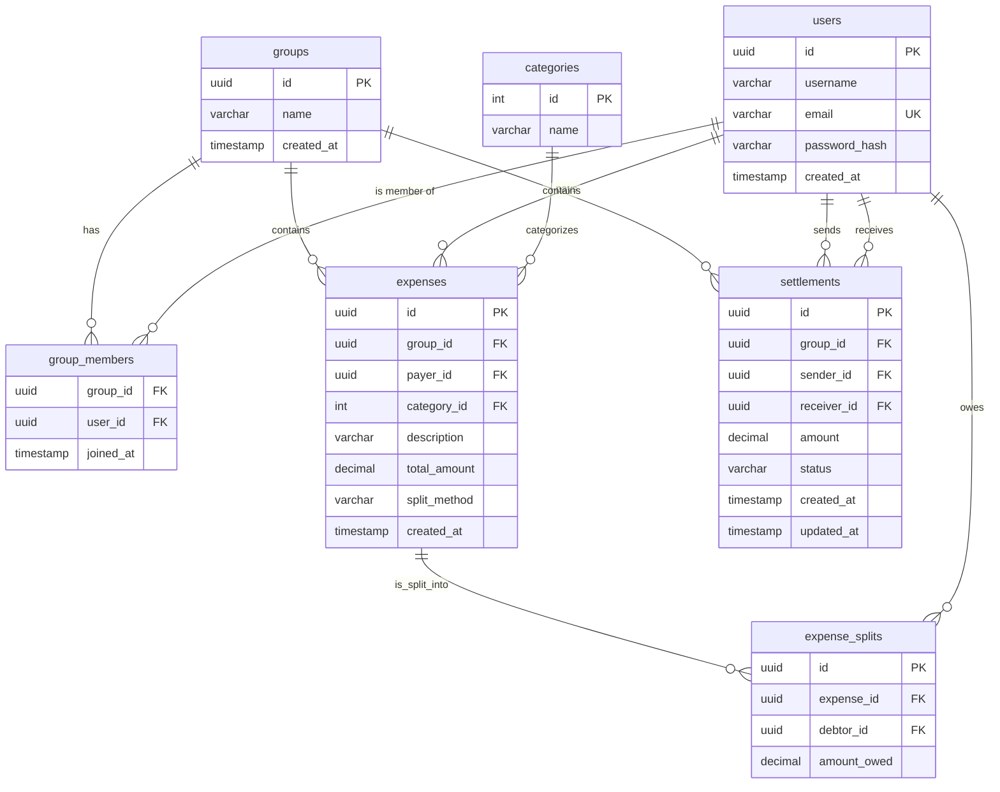

```mermaid
erDiagram
    users {
        uuid id PK
        varchar username
        varchar email UK
        varchar password_hash
        timestamp created_at
    }

    groups {
        uuid id PK
        varchar name
        timestamp created_at
    }

    group_members {
        uuid group_id FK
        uuid user_id FK
        timestamp joined_at
    }

    categories {
        int id PK
        varchar name
    }

    expenses {
        uuid id PK
        uuid group_id FK
        uuid payer_id FK
        int category_id FK
        varchar description
        decimal total_amount
        varchar split_method
        timestamp created_at
    }

    expense_splits {
        uuid id PK
        uuid expense_id FK
        uuid debtor_id FK
        decimal amount_owed
    }

    settlements {
        uuid id PK
        uuid group_id FK
        uuid sender_id FK
        uuid receiver_id FK
        decimal amount
        varchar status
        timestamp created_at
        timestamp updated_at
    }

    groups ||--o{ group_members : has
    users ||--o{ group_members : "is member of"
    groups ||--o{ expenses : contains
    users ||--o{ expenses : pays
    categories ||--o{ expenses : categorizes
    expenses ||--o{ expense_splits : is_split_into
    users ||--o{ expense_splits : owes
    groups ||--o{ settlements : contains
    users ||--o{ settlements : sends
    users ||--o{ settlements : receives
```